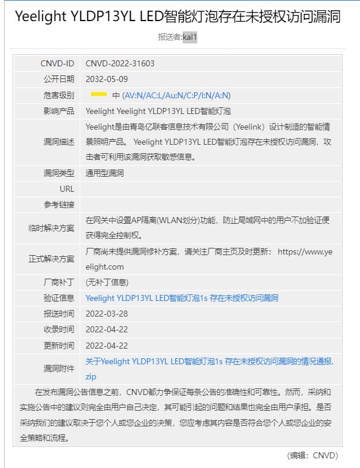
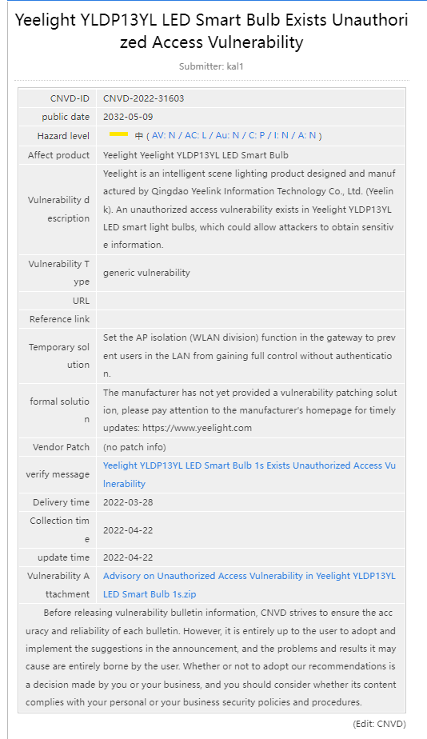

# Yeelight YLDP13YL LED Smart Bulb 1s Unauthorized Access Vulnerability Report

## 1. Basic information

- Vendor： Yeelight
- Product： YLDP13YL LED smart light bulb 1s
- Model ：yeelink.light.color8
- Version： 2.1.7_0036 and so on 
- Vulnerability Type: Unauthorized Access Vulnerability
- Vulnerability effect: Any user on the LAN can gain full control after learning the IP address of the device

## 2. Principle description of vulnerability technology

- In the Yeelight YLDP13YL LED smart light bulb 1s device, its device management control interface has no authentication measures by default. An attacker can use the SSDP discovery packet in the local area network to learn the device ip and send it to the device management control interface without any verification. Control information and gain full device control.

## 3. Vulnerability value

- Stable reproducibility: Yes

- Exploit conditions：
  - attack vector type: LAN
  - Stability of exploit: every attack can be successful
  - Whether the product is configured by default: there are loopholes in the functional components that are enabled at the factory
- Vulnerability Score (refer to CVSS)
  - V2：[6.1 MEDIUM (AV:A/AC:L/Au:N/C:N/I:N/A:C)](https://nvd.nist.gov/vuln-metrics/cvss/v2-calculator?vector=(AV:A/AC:L/Au:N/C:N/I:N/A:C))
  - V3.1：[6.5 MEDIUM (AV:A/AC:L/PR:N/UI:N/S:U/C:N/I:N/A:H)](https://nvd.nist.gov/vuln-metrics/cvss/v3-calculator?vector=AV:A/AC:L/PR:N/UI:N/S:U/C:N/I:N/A:H&version=3.1)

- CNVD ID：CNVD-2022-31603

### 4. PoC

[expliot.py](./expliot.py)

## 七、漏洞原理

In the `Yeelight YLDP13YL LED Smart Bulb 1s` device, sensitive information is transmitted in clear text, and an attacker can capture and decrypt the traffic, including all the status of the bulb, network configuration, etc.

SSDP (Simple Service Discovery Protocol) uses a specific port of the **239.255.255.250** multicast address to discover UPnp services. The full name of UPNP is Universal plug-and-play. UPnP is an architecture designed for pervasive peer-to-peer networking of smart appliances, wireless devices, and personal computers of various form factors. It is designed to provide an easy-to-use, flexible, standards-based connection to the home, small business, public spaces, or ad-hoc or unmanaged networks connected to the Internet.

After the `LAN control` is enabled on the device, since the device management control interface has no authentication measures by default, the attacker can know the current Status information for such devices exists on the local area network. After learning the device ip, it can send control information to the device management control interface without any verification to obtain complete device control.

## CNVD reference

- Chinese page
  - 
- English page
- 
